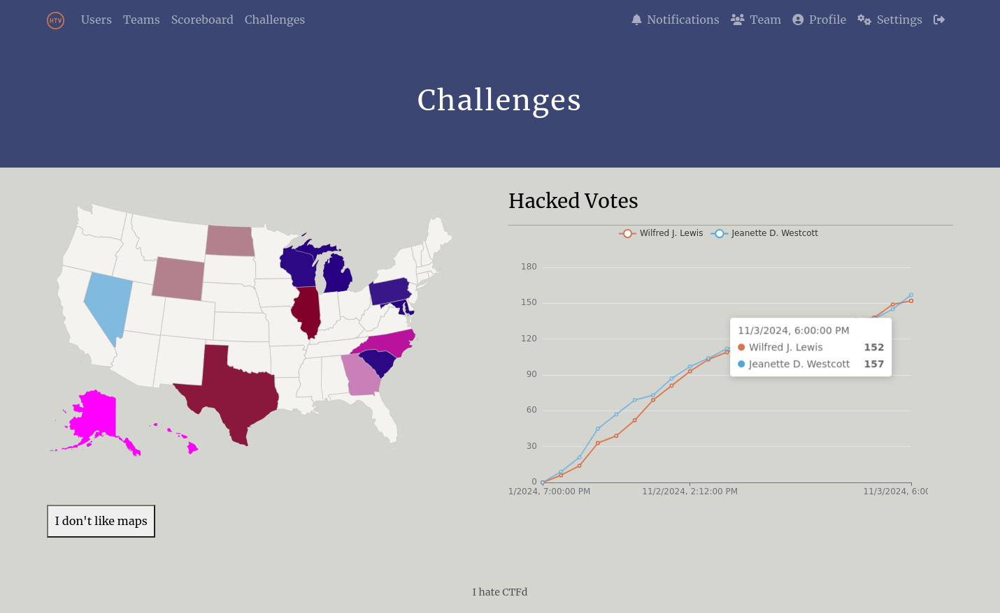
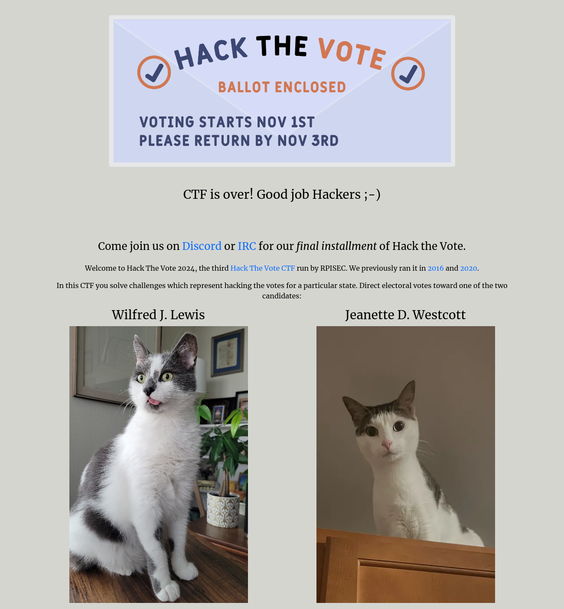
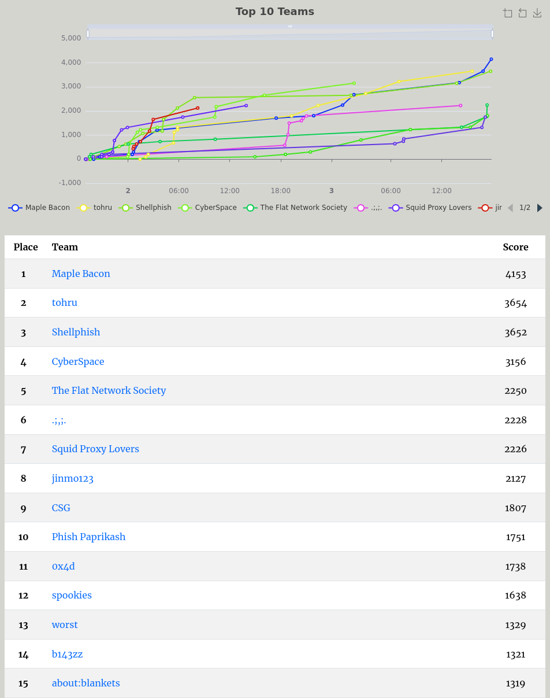
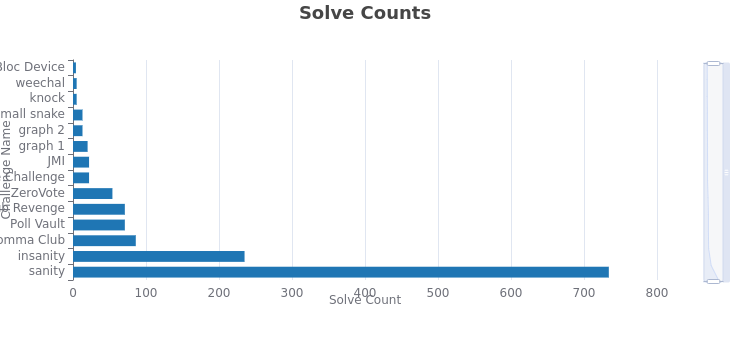

# Hack The Vote 2024

Hack The Vote 2024 was run by [RPISEC](https://rpis.ec) from November 1st to 3rd, 2024 (2024-11-01T23:00Z/2024-11-03T23:00Z).

Congratulations to the top 3 teams:

1st place: Maple Bacon (solved all challenges)  
2nd place: tohru  
3rd place: Shellphish  

This was the last edition of HTV. There may be future RPISEC CTFs, but we are retiring the Hack The Vote series.

## Theme

This year we simulated a presidential election between Wilfred J. Lewis and Jeanette D. Westcott, two cats. After every solve, teams redirected hacked votes to one of the candidates. Westcott had a narrow lead through most of the competition with a few brief takeovers, but was ultimately hacked the winner at 157 votes, with Lewis trailing at 152.

## Statistics

|  |  |
| --- | --- |
| Teams registered | 1177 |
| Teams scored: | 758 |
| Sanity solves | 734 |
| Insanity solves | 235 |
| Correct flags | 1357 |
| Incorrect flags | 714 |
| Points available | 4153 |
| Number of challenges | 12 |
| 1st place challenges solved | 12 |

For the first time in HTV history, there were no unsolved challenges.

## Organizers

Andrew Fasano, Josh Ferrell, Michael Jones, Michael Krasnitski, Andrew Marumoto, Austin Ralls, Max Shavrick, Glenn Smith, and Avi Weinstock
